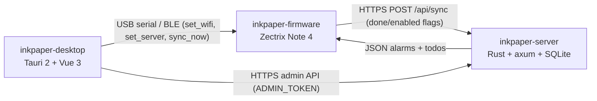

# Inkpaper

**Inkpaper** is an open-source e-ink "calendar / alarms / todos" system for
the **Zectrix Note 4** — a 4.2″ 400×300 e-paper ESP32-S3 notebook. It is
offline-first: alarms are stored on the device and rung by the RTC
hardware, so a fully-charged Note 4 wakes you up even with no network.

## The three repositories

This project is split into three sibling repositories — one per layer. A
single URL to remember: **`github.com/counhopig/inkpaper`** (this one) is
the entry point; follow the links below for the code.

| Repository | Role | Stack |
| --- | --- | --- |
| [**inkpaper-firmware**](https://github.com/counhopig/inkpaper-firmware) | Zectrix Note 4 firmware: calendar, alarms, todos, sync, USB/BLE config | Rust, ESP-IDF, PCF8563 RTC, SSD2683 EPD |
| [**inkpaper-server**](https://github.com/counhopig/inkpaper-server) | Personal cloud backend: per-device alarms/todos + sync endpoint, embedded admin UI | Rust, axum, SQLite |
| [**inkpaper-desktop**](https://github.com/counhopig/inkpaper-desktop) | PC tool: configure the device over USB/BLE, author content, view logs | Tauri 2, Vue 3, TypeScript |

## How it works

The device never authors content. The PC tool pushes configuration
(Wi-Fi credentials, server URL + token) over USB serial or BLE; alarms and
todos live on the server and are pulled as structured JSON over Wi-Fi —
not as server-rendered images — so the firmware itself knows the alarm
times and can ring offline.

## Quick start

- **Firmware** — build with an ESP-IDF toolchain, flash over USB:
  see [inkpaper-firmware](https://github.com/counhopig/inkpaper-firmware#quick-start).
- **Server** — `./scripts/start.sh` or `cargo run --release`:
  see [inkpaper-server](https://github.com/counhopig/inkpaper-server#run).
- **Desktop** — `npm install && npm run tauri dev`:
  see [inkpaper-desktop](https://github.com/counhopig/inkpaper-desktop#develop).

## Screens

Rendered straight from the firmware's UI code:

| Home | Calendar |
| --- | --- |
|  |  |

## License

[Apache-2.0](LICENSE).
